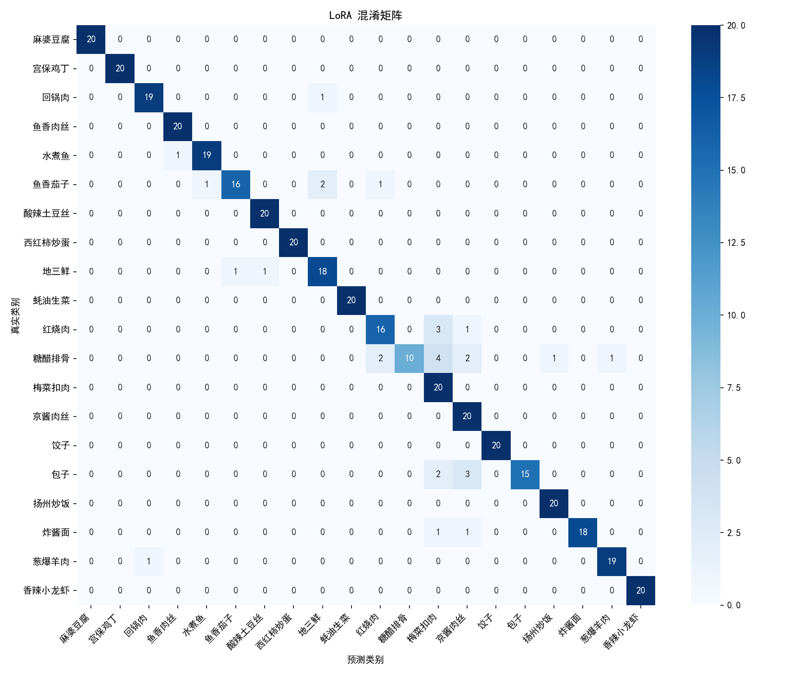
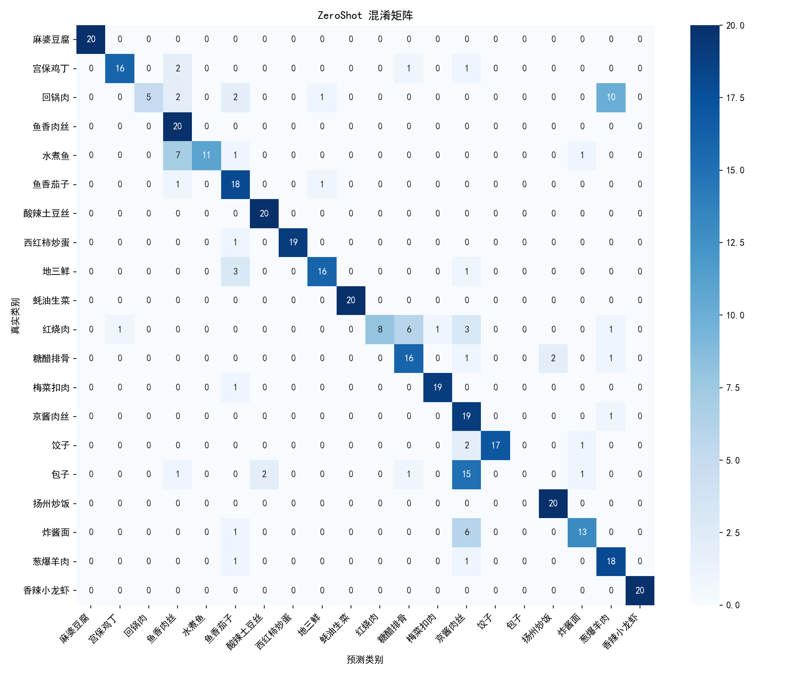

> 姓名：王铭翔                 学号：3250102670                 专业：人工智能                 日期：2026.7.29

# 小作业：中餐食物分类

## 作业概况

### 任务内容

中餐食物分类是食物卡路里识别的前置任务。本次小作业完成了中餐食物数据集构建，选用 Chinese-CLIP 实现了中餐食物的零样本分类，并将其中一种文本提示模版准确率作为 baseline。同时进一步采取了 Few-shot 学习、LoRA 微调、OpenCV 数据增强三种方式进行了分类性能提升尝试。最后对分类结果进行系统性分析并撰写实验报告。

### AI Agent 使用情况

本次小作业过程中使用了 Codex 作为 AI Agent 辅助，其使用情况具体如下：

- 实验内容梳理：Agent 读取作业要求 markdown 文档，梳理作业的知识讲解和任务结构，帮助快速建立作业整体框架的理解。
- 错误分析辅助：作业过程中遇到的部分报错，由 Agent 辅助分析报错信息并给予纠错引导。

作业全程 AI Agent 未直接参与代码编写和实验报告撰写，所有代码和实验报告均由本人逐字编写。

## 作业过程

### 数据集构建

数据集构建脚本为 `build_dataset.py`。

#### 数据来源与类别选择

数据来源是网上的公开数据集已有的 `ChineseFood Net 3`，原始共 208 类中餐菜品，每类数百张图。由于作业要求文档中提到需要提交数据集构建脚本并提交数据集，于是通过编写脚本，从中挑了 20 道常见的菜（我爱吃的）：麻婆豆腐、宫保鸡丁、回锅肉、鱼香肉丝、水煮鱼，糖醋排骨，梅菜扣肉，京酱肉丝、葱爆羊肉，饺子、包子、炸酱面，扬州炒饭，地三鲜，香辣小龙虾等。类名映射取自 `ChineseFood Net 3/class_names.xlsx`。

#### 数据划分策略

严格按题目要求的 7:1:2，每类数量为 **训练 70 / 验证 10 / 测试 20 = 100 张**。优先选取了 ChineseFoodNet 中 `test/` 目录下的图片，若数量不足再从 train 里补。固定随机种子 42 便于复现。

#### 输出目录结构

最终输出在 `dataset_20cls/`，结构如下：

```
dataset_20cls/
  classes.csv        # 类别表: idx, zh, en, orig_id
  train.csv / val.csv / test.csv        # 每个 split 的 (路径, 标签) 清单
  train/<idx>_<name>/*.jpg        # 文件夹名前缀就是整数标签
  val/  ...
  test/ ...
```

文件夹名形如 `00_麻婆豆腐`，前两位数字就是类别序号 idx。

### 零样本分类实现

零样本分类脚本为 `zero_shot.py`。

#### 模型选型

选用的 VLM 是 **Chinese-CLIP**（`OFA-Sys/chinese-clip-vit-base-patch16`）。通过询问 AI Agent 得知 Chinese-CLIP 有如下优点：菜名是中文，Chinese-CLIP 文本编码器原生懂中文；本地电脑只有 RTX 4050 Laptop 6GB 显存，base-patch16 约 750MB 正合适；作业要求文档中提到的各 CLIP 模型中它对中餐最为敏感。

#### CLIP 零样本原理

通过询问 AI Agent 和查阅相关资料学习到：CLIP 的零样本原理是双编码器加余弦相似度，把 20 个菜名各套进一个文本模板得到 20 条文本，过文本编码器得到 `[20, 512]` 的文本特征矩阵；每张测试图过图像编码器得到 `[1, 512]` 的图片特征；两者做点积，取最大值，即得到预测类别。文本特征只依赖菜名和模板、和图片无关，所以全程算一次就能复用所有图片。

#### 关键细节

```python
text_feats = text_feats / text_feats.norm(dim=-1, keepdim=True)      # L2 归一化
logits = 100.0 * pic_feats @ text_feats.T     # ×100 温度缩放
```

- **L2 归一化**：把向量变成单位长度，点积就等于余弦相似度，在 [-1, 1] 之间可比；
- **×100 温度缩放**：CLIP 训练时的温度参数惯例，对 argmax 排序无影响，但写上会更符合原模型设定。

#### Prompt 模板对比

题目要求对比至少 3 种 prompt 模板，本次作业做了 6 种，结果如下（test 集 400 张）：

| 模板 | Top-1 | Top-5 |
|---|---|---|
| `一张{c}的照片` | 78.75% | 92.75% |
| `{c}` | 78.50% | 94.50% |
| `一张盘子上有{c}的照片` | 83.25% | 98.25% |
| `一张近距离拍摄{c}的照片` | 72.50% | 89.25% |
| `一张中餐菜品{c}的照片` | **93.00%** | 98.75% |
| `一张盘子上摆着中餐菜品{c}的照片` | 92.00% | 99.00% |

最好的是 `一张中餐菜品{c}的照片`，Top-1 达到 93%。但我将 `一张{c}的照片`（78.75%）作为后续 Few-shot 和 LoRA 等调优的对照 baseline，便于明显体现调优的增长。

#### 踩坑：get_features 返回值

实现过程中遇到报错：

```
AttributeError: 'BaseModelOutputWithPooling' object has no attribute 'text_embeds'
```

通过询问 AI Agent，这个版本的 `ChineseCLIPModel.get_text_features()` / `get_image_features()` 返回的不是最终 512 维嵌入，而是未过投影的 `BaseModelOutputWithPooling` 隐藏状态对象，直接 `.norm()` 会报错。通过进一步查询得知，模型实际结构是：

```
text_model → last_hidden_state → 取[CLS] token → text_projection → 512维
vision_model → last_hidden_state → 取[CLS] token → visual_projection → 512维
```

在 AI 的辅助下，找到以下解决方法：手动取 `last_hidden_state[:, 0, :]`（CLS token 输出）再过对应的 projection 层，代码里写了兼容判断：优先用 `.text_embeds`/`.image_embeds`，否则手动取 CLS 投影。这个报错说明不同 transformers 版本 API 行为不一致，照搬网络代码容易踩雷，要以实际打印出的 shape 为准。

### Few-shot 少样本学习

Few-shot 脚本为 `few_shot.py`，`FewShot` 类继承自 `zero_shot.py` 的 `ZeroShot` 类，以便复用大部分方法。

#### prototype 分类

方法选的是 **10-shot prototype 分类**：每类从训练集随机抽 10 张图，用图像编码器提取特征后求平均，得到该类的"原型向量"（prototype），20 个类的原型拼成 `[20, 512]`。测试图和这些原型算余弦相似度取最大，就是预测类别。

所以 Few-shot 不需要提示词 template，真正参与分类的是每类支持集图片的平均图像向量。

#### 实验参数与结果

实验参数：K=10、随机种子 67、20 类共 200 张支持集图片。结果：

| 方法 | Top-1 | Top-5 | 相对 baseline |
|---|---|---|---|
| 零样本 baseline（`一张{c}的照片`） | 78.75% | 92.75% | — |
| Few-shot 10-shot prototype | 90.50% | 98.50% | +11.75 / +5.75 |

Top-1 提升 11.75，满足任务3 "提升 ≥5%" 的要求。

由于 Few-shot 没有改模型权重，只是用真实图片特征代替文本特征，所以其准确率仍取决于 Chinese-CLIP 预训练时学到的图文对齐质量，存在局限性。

### LoRA 微调

LoRA 训练脚本为 `lora_train.py`，评估脚本为 `lora_eval.py`。

#### LoRA 原理

LoRA的思路是：冻结原模型全部权重 W₀ 不动，只在旁边加一条旁路 `A→B`，用低秩矩阵的乘积 `B·A` 来近似全量微调时要学的更新量 ΔW。

#### `scripts/inspect_model.py` 探查 Q / V 层

LoRA 惯例插在注意力的 Q/V 投影层，但 Chinese-CLIP 两个塔的命名风格不一样，用 `scripts/inspect_model.py` 打印 `named_modules` 后，发现文本塔和视觉塔的 Q/V 层命名并不一致：

- 文本塔：`...attention.self.query` / `...attention.self.value`
- 视觉塔：`...self_attn.q_proj` / `...self_attn.v_proj`

所以 `target_modules=["query", "value", "q_proj", "v_proj"]`，peft 按后缀匹配，共注入 48 层（2 塔 × 12 层 × 2 投影）。由程序输出可知，注入后可训练参数 589,824，占全部 1.9 亿参数的 0.31%。

#### 训练目标

训练目标是 CLIP 式的 InfoNCE 对比损失。一个 batch 16 对图文，算 `[16,16]` 相似度矩阵，对角线是正样本（第 i 张图配第 i 条文本），其余是负样本：

```python
logits = model.logit_scale.exp() * (img_feats @ txt_feats.T)   # [16,16], logit_scale≈100 是可学习温度
labels = torch.arange(logits.shape[0])                         # 对角线 [0,1,...,15]
loss = (F.cross_entropy(logits, labels) + F.cross_entropy(logits.T, labels)) / 2   # 图文双向
```

双向取平均是 CLIP 原论文做法：让图文互相检索，对称对齐。特征算完各自 L2 归一化，点积就是余弦相似度。优化器只把 `requires_grad=True` 的参数（即 LoRA 的 A、B）传进去，用 AdamW、lr=2e-4、weight_decay=0.01。

#### 训练过程与过拟合监控

训练 10 个 epoch，每轮在 val 集（200 张）上算 Top-1，只在 val 超过原有准确率时保存 adapter：

```
Epoch 1: loss=0.7705, val=75.00%
Epoch 2: loss=0.6314, val=86.50%
Epoch 3: loss=0.5978, val=87.50%
Epoch 4: loss=0.5924, val=92.50%
Epoch 5: loss=0.5440, val=93.00%
Epoch 6: loss=0.5118, val=92.50%
Epoch 7: loss=0.4993, val=94.50%     # 峰值, 最终采用
Epoch 8: loss=0.4795, val=94.50%
Epoch 9: loss=0.4953, val=92.50%     # 开始过拟合
Epoch 10: loss=0.5053, val=92.00%
```

#### 评估与横向对比

评估时用 `lora_eval.py` 重新加载 base 模型，再用 `PeftModel.from_pretrained` 把 adapter 挂上去，复用 `zero_shot.py` 的方法在 test 集 400 张上评估，模板和 baseline 一致（`一张{c}的照片`）。三种方法进行对比：

| 方法 | 改权重 | Top-1 | Top-5 | 对比 baseline |
|---|---|---|---|---|
| 零样本 baseline | 否 | 78.75% | 92.75% | — |
| Few-shot 10-shot | 否 | 90.50% | 98.50% | +11.75 / +5.75 |
| **LoRA 微调 (r=8)** | **是 (0.31%)** | **92.50%** | **99.25%** | **+13.75 / +6.50** |

LoRA 取得三种方法里最好的成绩，Top-1 提升 13.75 个百分点，远超 ≥5% 的要求。训练出的 adapter 文件只有 2.4MB，对比 base 模型 750MB，可以在线切换。

### 数据增强

训练脚本为 `data_aug_train.py` ，从 `lora_train.py` 中导入了各函数和类以便复用，增强 adapter 存于 `results/lora_adapter_aug/`，评估脚本为 `lora_eval.py`。

#### 增强方法

本次用 OpenCV 实现了作业要求文档中提到的三类增强，：

| 方法 | OpenCV 操作 | 参数 | 作用 |
|---|---|---|---|
| 旋转 | `getRotationMatrix2D` + `warpAffine ` | ±15° | 模拟不同拍摄角度 |
| 随机裁剪 | numpy 切片 + `resize` 回原尺寸 | 保留 80%~100% | 模拟食物位置/大小变化 |
| 颜色抖动 | 转 HSV 格式改变 H/S/V 通道 | ±10 | 模拟不同光照/白平衡 |

三种方法各设 50% 概率独立应用，不每张都增强，防止增强过度。每次 `__call__` 现做现用，相当于在线生成无限数据集，而不是预先将一批增强图存在硬盘。

#### 关键细节

`FoodDataset.__getitem__` 返回的是 PIL 图（RGB 顺序），但 OpenCV 默认按 BGR 处理，进出 OpenCV 需要进行转换。

#### 结果与对比

test 集 400 张评估结果，Top-1 略微下降，Top-5 持平：

| 方法 | 增强 | Top-1 | Top-5 | vs 无增强 LoRA |
|---|---|---|---|---|
| 无增强 LoRA | 否 | 92.50% | 99.25% | — |
| 增强版 LoRA | 是 | 91.50% | 99.25% | **−1.0 / 0** |

#### 训练曲线

对比两条 val 识别准确率曲线：

```
Epoch    无增强 val    增强版 val
  1       75.00%        85.50%
  2       86.50%        94.00%
  3       87.50%        93.00%
  4       92.50%        94.50%
  5       93.00%        93.00%
  6       92.50%        93.50%
  7       94.50% 峰     93.50%
  8       94.50%        95.50% 峰
  9       92.50% ↓      95.50%
  10      92.00% ↓      95.50%    ← 不回落
```

- val 峰值更高：无增强 94.50%，增强版 **95.50%**，提高 1%。

- 过拟合被消除：无增强版 epoch 9/10 掉到 92.5%/92.0%；增强版 epoch 9/10 停在 95.5% 未回落。

- train_loss 更高：无增强 epoch 10 loss≈0.5053，增强版 epoch 10 loss≈0.5174。增强让训练图变难了，模型没法把 loss 压到极低，所以没有过拟合。train_loss 高在这里是泛化更好的信号。

#### 结论

数据增强的 val 曲线不再回落、峰值更高，成功消除了过拟合；但评估 test 集准确率未上升，这是因为模型已接近该任务的准确率上限。

## 结果分析与可视化

以 LoRA 微调后的模型为主分析对象（test Top-1=92.50%）.

### 混淆矩阵

#### LoRA（test Top-1=92.50%）



混淆矩阵行为真实类别，列为预测类别，对角线格子颜色越深表示该类预测正确的数量越多。从上图 LoRA 的混淆矩阵可以看到，大部分类别的对角线都接近满值 20，说明模型对大部分中餐菜品有良好区分能力。

将非对角线按错误数量排序，错误数量领先的几组混淆为：

| 错误张数 | 真实类别 → 预测类别 | 原因 |
|---|---|---|
| 4 | 糖醋排骨 → 梅菜扣肉 | 红烧肉块互混 |
| 3 | 包子 → 京酱肉丝 | 主食与肉块互混 |
| 3 | 红烧肉 → 梅菜扣肉 | 红烧肉块互混 |
| 2 | 包子 → 梅菜扣肉 | 主食与肉块胡混 |
| 2 | 糖醋排骨 → 京酱肉丝 | 肉块认成肉丝 |
| 2 | 糖醋排骨 → 红烧肉 | 红烧肉块互混 |
| 2 | 鱼香茄子 → 地三鲜 | 蔬菜互混 |
| 1 | 葱爆羊肉 → 回锅肉 | 肉片互混 |

可以注意到，错误分类不是严格对称的，例如糖醋排骨 4 次被误判为梅菜扣肉，但梅菜扣肉却几乎不会被误判为糖醋排骨。这说明梅菜扣肉容易将其他红棕色带酱汁的肉块类菜品纳进自身分类，而它自身特征足够明显不容易被反向混淆。

通过归纳可以发现存在以下四类常见混淆原因：

- 红烧肉块混淆：如将糖醋排骨误认为梅菜扣肉、将红烧肉误认为梅菜扣肉
- 主食与肉块混淆：如将包子误认为京酱肉丝、将包子误认为梅菜扣肉
- 蔬菜混淆：如将鱼香茄子误认为地三鲜
- 肉片混淆：如将葱爆羊肉误认为回锅肉

#### ZeroShot（`一张{c}的照片`）（test Top-1=78.75%）



作为对照，零样本 baseline 的混淆矩阵非对角线深色格明显更多、分布更分散。而经过 LoRA 微调后，这些分散错误被大幅收敛，可见 LoRA 微调起到的明显提升作用。

### 失败案例分析

从 LoRA 错分的 30 张 test 图中，选取部分代表性案例进行分析，并将 baseline 与 LoRA 调优结果进行对比。

#### **糖醋排骨 → 梅菜扣肉（红烧肉块混淆）**

`test/11_糖醋排骨/11_004551.jpg`

糖醋排骨和梅菜扣肉都是红棕色、表面裹着浓稠酱汁的肉块。这张图里糖醋排骨表面反光的糖醋汁与梅菜扣肉的酱汁在颜色和光泽上高度相似，且排骨切成了与扣肉相近的块状，缺乏形状上的区分线索。零样本 baseline 在这张图上预测正确，而是 LoRA 训练后，模型对"红棕色肉块"的判别边界发生了偏移，把这张图也归入了梅菜扣肉。

#### **红烧肉 → 梅菜扣肉（红烧肉块混淆）**

`test/10_红烧肉/10_007437.jpg`

红烧肉与梅菜扣肉本就是同源菜式，区别主要在于梅菜扣肉有梅干菜垫底。该图片拍摄角度较近，梅干菜被肉块遮挡或未入镜，画面里只剩红棕色肉块和酱汁，因此与红烧肉十分相近。零样本 baseline 在这张图上误判为蚝油生菜，几乎没有关联性，错误程度较重；LoRA 分类结果则与红烧肉本身具有更多相似性，但仍未完全区分。

#### **鱼香茄子 → 地三鲜（蔬菜混淆）**

`test/05_鱼香茄子/05_000913.jpg`

鱼香茄子和地三鲜都是切块的蔬菜经过油炒、裹着红棕色酱汁的形态。该图中茄子块占主体、缺少鱼香风味特有的肉末和辣椒点缀，视觉上更接近地三鲜的"纯蔬菜炒制"外观。零样本 baseline 在这张图上同样误判为地三鲜，微调前后都没有区别开来。

#### **葱爆羊肉 → 回锅肉（肉片混淆）**

`test/18_葱爆羊肉/18_017106.jpg`

葱爆羊肉和回锅肉都是切片的肉类与配菜大火翻炒，成品都呈深棕色片状。该图若缺少明显的葱段或羊肉特有的大片形态，模型主要依据"深色肉片"判断，因此容易归为回锅肉。零样本 baseline 在此图也误判为回锅肉。

#### **包子 → 京酱肉丝/梅菜扣肉（主食误判为肉）**

`test/15_包子/15_000019.jpg`（→ 京酱肉丝）、`test/15_包子/15_005635.jpg`（→ 梅菜扣肉）

这是有些令人诧异的错判，包子是面食主食，却被误判为肉丝或肉块。观察图片可以发现，部分包子的馅料在蒸汽下色泽偏深棕，折叠的褶皱在俯拍角度下与肉丝或肉块的纹理有几分相似，模型可能被"深色团块"的局部特征误导。然而零样本 baseline 在这两张图上均预测正确，说明这组错误是 LoRA 微调引入的新偏差。模型已接近上限，进一步调试可能在个别类别上引入噪声。

### 菜系分层分析

通过查询资料和询问 AI Agent，按菜系对 20 个类别分组，统计各菜系在 test 集上的准确率：

| 菜系 | 包含类别 | test 图数 | Top-1 准确率 |
|---|---|---|---|
| 川菜 | 麻婆豆腐、宫保鸡丁、回锅肉、鱼香肉丝、水煮鱼、鱼香茄子 | 120 | 90.0% |
| 家常/东北 | 酸辣土豆丝、西红柿炒蛋、地三鲜 | 60 | 96.7% |
| 粤菜 | 蚝油生菜、梅菜扣肉 | 40 | 100.0% |
| 苏浙 | 糖醋排骨 | 20 | 50.0% |
| 京鲁 | 京酱肉丝、葱爆羊肉 | 40 | 97.5% |
| 北方主食 | 饺子、包子、扬州炒饭、炸酱面 | 80 | 86.3% |
| 湘/家常 | 香辣小龙虾 | 20 | 100.0% |

- **最高（100%）**：粤菜、湘/家常。蚝油生菜、梅菜扣肉、香辣小龙虾视觉特征鲜明，如生菜的绿色、小龙虾的红色甲壳都极具辨识度。
- **最低（50%）**：苏浙菜（只有糖醋排骨一类）。糖醋排骨 20 张里只对 10 张，错分全部流向梅菜扣肉、红烧肉等同类红棕色肉块。
- **次低（86.3%）**：北方主食。主要被包子（75%）拉低，原因正是前文分析的"深色主食误判为肉"。
- **川菜（90.0%）**：虽然麻婆豆腐、宫保鸡丁、鱼香肉丝分类准确率都是 100%，但鱼香茄子只有 80%，内部差距较大。

结论：模型对不同菜系的识别能力差异与"菜系"这一人文分类关联性不大，而更在于菜品本身的视觉同质化程度。视觉特征鲜明（生菜绿、小龙虾红）的类别准确率极高，而视觉同质化严重（红棕色肉块、深色蔬菜炒制）的类别则更易出错。菜系分类只是基于人文的地域分类，与其本身识别难易程度无直接关联。

### 综合结论

整体来看，LoRA 微调后的模型对 20 类中餐取得了 92.5% 的 Top-1 准确率，11 个类别达到 100%，主要错误集中在糖醋排骨（50%）、包子（75%）、鱼香茄子和红烧肉（80%）四个类别上。失败原因可归纳为四类视觉同质化场景：红烧肉块混淆、主食误判为肉、蔬菜炒制混淆、肉片混淆。

进一步的改进，可以针对红烧肉块互混这一问题考虑引入更细的局部特征判断（如检测酱汁光泽、肉块切面纹理）或多任务监督（同时预测烹饪方式），摆脱对全局图像特征的单一依赖。

## 附录

[Github 仓库](https://github.com/ColorlessSink/ChineseFoodClassification)

